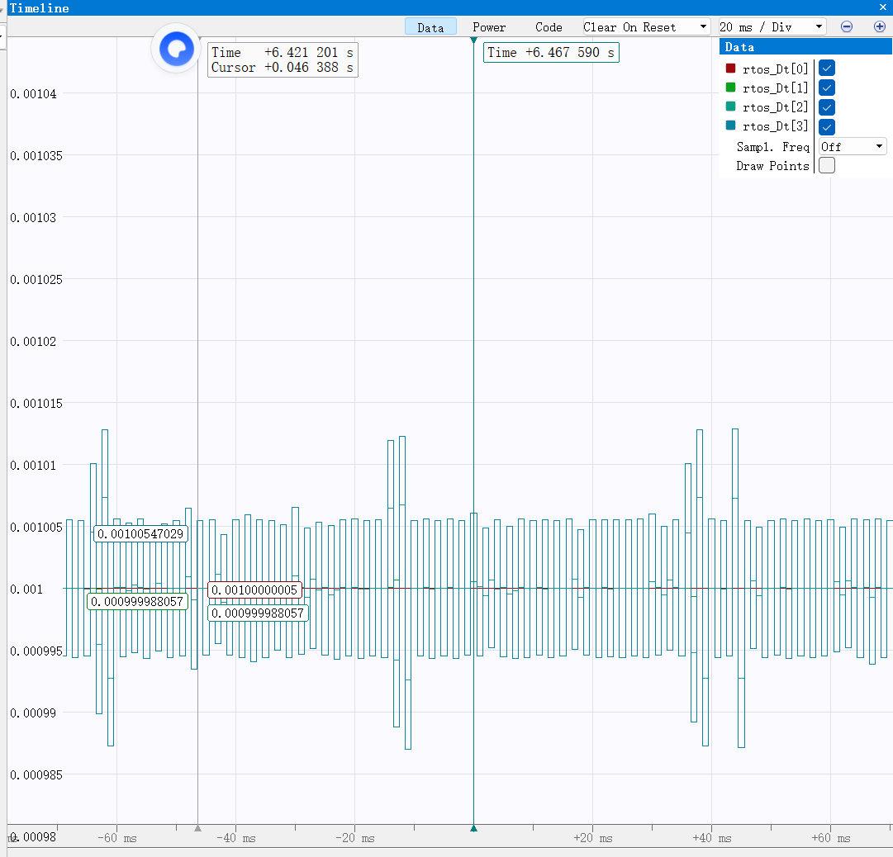

## VT13操作方式
以图传链路方式（键鼠控制）整车
## Booster
- 按键B ：切换单发与连发，只作用于手控，自瞄模式下不受影响
- 按键Ctrl : 切换摩擦轮状态
- 鼠标左键 ： 长按右键+长按左键=自瞄自动打弹 、 松开右键+单击/长按左键=手控打弹
## Chassis
- 按键W : 底盘往前运动
- 按键S : 底盘往后运动SS
- 按键A : 底盘往左运动
- 按键D : 底盘往右运动SSS
- 按键Shift : 底盘在移动的基础上按住Shift加速
- 按键E : 切换小陀螺与随动
- 按键R : 刷新UI （建议在准备阶段长按R一段时间）
## Gimbal
- 鼠标右键 ： 长按进入自瞄模式，松开后进入手控模式
- 按键C ：一键调头

## 2026/3/20日
- 底盘出现走不直的问题，已排除底盘的力控/速控问题，大概率是底盘的结构重装问题。
- 云台修改为上赛季区域赛的参数后，响应效果比较好，但是电机存在运动噪声。

## 2026/3/21日
- 发射机构添加了自瞄自动射击功能，由于自动有限热量状态机/裁判系统回传均存在物理上的延迟，直接使用Fire值会导值热量计算/获取延后从而多拨很多发弹导致超热量，因此给自瞄的自动开火fire添加了一个定时判断，经过测试可以初步限制住热量，也能实现自瞄的自动打弹。
```
static uint32_t tim_delay1 = 0, last_tim_delay1 = 0;
                        static uint8_t Switch_Flag1 = 0;
                        tim_delay1 = HAL_GetTick();

                        if (tim_delay1 - last_tim_delay1 >= 100)
                        {
                            
                            last_tim_delay1 = tim_delay1;

                            if (MiniPC.Get_Fire_Status() == 1 && MiniPC.Get_MiniPC_Status() == MiniPC_Status_ENABLE)
                            {
                                Booster.Set_Booster_Control_Type(Booster_Control_Type_SINGLE);
                                Switch_Flag1 = 1;
                            }
                            else
                            {
                                Booster.Set_Booster_Control_Type(Booster_Control_Type_CEASEFIRE);
                                if (Switch_Flag1 == 1)
                                {
                                    float tmp_now_dirve = Booster.Motor_Driver.Get_Now_Radian();
                                    Booster.Set_Target_Drvier_Angle(tmp_now_dirve);
                                    Switch_Flag1 = 0;
                                }
                            }
                        }
```
- 修改框架中crt_booster.cpp中的bug，拨盘控制在角度环与速度环之前切换时，出现实际角度在更新，但是目标角度并没有更新，导致拨盘会先回拨到旧值，导致异常会拨很大的角度，解决办法如下：
```
添加过渡标志，来调整目标值与实际值相对应，以便从速度环平滑过渡到角度环
        if (Swtich_To_Angle_Control_Flag == 1)
        {
            Drvier_Angle = Motor_Driver.Get_Now_Radian();

            Swtich_To_Angle_Control_Flag = 0;
        }
```
## 2026/4/7
- 更新了freeertos，创建了4个任务，在初始完成、开启任务调度后，任务调度器自行调用这4个任务。
```
osThreadId insTaskHandle;
osThreadId remote_and_aliveTaskHandle;
osThreadId robotTaskHandle;
osThreadId can_txTaskHandle;

__attribute__((noreturn)) void StartINSTASK(void const *argument);
__attribute__((noreturn)) void StartREMOTE_AND_ALIVE_TASK(void const *argument);
__attribute__((noreturn)) void StartROBOTTASK(void const *argument);
__attribute__((noreturn)) void StartCAN_TX_TASK(void const *argument);

void OSTaskInit()
{
    osThreadDef(instask, StartINSTASK, osPriorityAboveNormal, 0, 1024);
    insTaskHandle = osThreadCreate(osThread(instask), NULL); // 由于是阻塞读取传感器,为姿态解算设置较高优先级,确保以1khz的频率执行
    // // 后续修改为读取传感器数据准备好的中断处理,

    osThreadDef(remote_and_alive_task, StartREMOTE_AND_ALIVE_TASK, osPriorityNormal, 0, 512);
    remote_and_aliveTaskHandle = osThreadCreate(osThread(remote_and_alive_task), NULL);

    // osThreadDef(daemontask, StartDAEMONTASK, osPriorityNormal, 0, 128);
    // daemonTaskHandle = osThreadCreate(osThread(daemontask), NULL);

    osThreadDef(robottask, StartROBOTTASK, osPriorityNormal, 0, 1024);
    robotTaskHandle = osThreadCreate(osThread(robottask), NULL);

    osThreadDef(can_tx_task, StartCAN_TX_TASK, osPriorityNormal, 0, 512);
    can_txTaskHandle = osThreadCreate(osThread(can_tx_task), NULL);
}

float rtos_Dt[4];
uint32_t rtos_Last_Cnt[4];

__attribute__((noreturn)) void StartINSTASK(void const *argument)
{
    for (;;)
    {
        rtos_Dt[0] = DWT_GetDeltaT(&rtos_Last_Cnt[0]);
#ifdef GIMBAL
        chariot.Gimbal.Boardc_BMI.TIM_Calculate_PeriodElapsedCallback();
#endif

        osDelay(1);
    }
}
__attribute__((noreturn)) void StartREMOTE_AND_ALIVE_TASK(void const *argument)
{
    for (;;)
    {
        rtos_Dt[1] = DWT_GetDeltaT(&rtos_Last_Cnt[1]);

        chariot.TIM1msMod50_Alive_PeriodElapsedCallback();

#ifdef GIMBAL
        chariot.FSM_Alive_Control.Reload_TIM_Status_PeriodElapsedCallback();
        chariot.FSM_Alive_Control_VT13.Reload_TIM_Status_PeriodElapsedCallback();
#endif

        osDelay(1);
    }
}
__attribute__((noreturn)) void StartROBOTTASK(void const *argument)
{
    for (;;)
    {
        rtos_Dt[2] = DWT_GetDeltaT(&rtos_Last_Cnt[2]);

        chariot.TIM_Calculate_PeriodElapsedCallback();

        osDelay(1);
    }
}
__attribute__((noreturn)) void StartCAN_TX_TASK(void const *argument)
{
    for (;;)
    {
        rtos_Dt[3] = DWT_GetDeltaT(&rtos_Last_Cnt[3]);
        
        // 统一打包发送
        TIM_CAN_PeriodElapsedCallback();

        static int rtos_mod5 = 0;
        rtos_mod5++;
        if (rtos_mod5 == 10) // 上下板通信 100hz
        {
#ifdef GIMBAL
            // 给下板发送数据
            chariot.CAN_Gimbal_Tx_Chassis_Callback();
            chariot.CAN_Gimbal_Tx_Chassis_Callback_1();
#elif defined(CHASSIS)
            // 底盘给云台发消息
            chariot.CAN_Chassis_Tx_Gimbal_Callback();
            chariot.CAN_Chassis_Tx_Gimbal_Callback_1();
#endif
            rtos_mod5 = 0;
        }

        osDelay(1);
    }
}

```
应用DWT测试每个任务的频率，曲线如下图所示，可能任务并不多，调度运行的效果还算可以。
